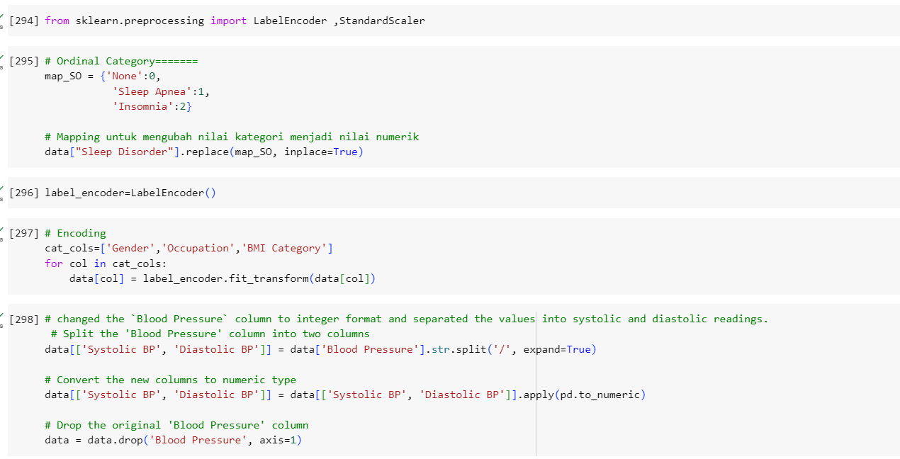

# **🌟 Sleep Disorder Prediction - Final Project Dibimbing 🌟**

## **⛳ Introduction⛳**

In our busy working lives, we often underestimate the significance of prioritizing a healthy lifestyle. Yet, sleep is undeniably vital for our overall health and wellness. Incorporating elements like a balanced diet, consistent exercise, and stress management can profoundly improve the quality of our sleep, thereby safeguarding our heart health.

## **📍 Table of Content 📍**
<!--ts-->
* **Business Understanding**
    * [Problem Statement](#-business-understanding-)
    * [Goals](#-goals)
    * [Objectives](#-objectives)
* **Data Understanding**
    * [Data Description](#-data-understanding-)
    * [Metadata](#-metadata)
* **Data Preparation**
    * [Data Cleansing](#-data-preparation-)
    * [Encoding](#-data-preparation-)
    * [Imbalance & Standardization](#-data-preparation-)
    * [Correlation Analysis](#-data-preparation-)
* **Exploratory Data Analysis**
    * [Relate By Gender](#-exploratory-data-anaylsis-)
    * [Relate By Occupation](#-occupation-)
    * [Relate By Physical Activity Level](#-physical-activity-level-)
    * [Relate By Quality of Sleep](#-quality-of-sleep-)
    * [Relate By Sleep Duration](#-sleep-duration-)
    * [Relate By Stress Level](#-stress-level-)
    * [Relate by Heart Rate](#-heart-rate-)
    * [Relate by Daily Steps](#-daily-steps-)
    * [Relate By BMI Category](#-bmi-category-)
    * [Relate by Age](#-age-)
    * [Relate by Blood Pressure](#-blood-pressure-)
* **Preprocessing**
    * [Preprocessing](#-preprocessing-)
    * [Heatmap Correlation](#-heatmap-correlation-)
* **[Modelling](#-modelling-)**
* **[Evaluation](#-evaluation-)**
* **[Insight & Recommendation](#-insight-&-recommendation-)**

<!--te-->

## **💻 Script 💻**

**Open in Colab**

- [Sleep-Disorder-Prediction.ipynb](Finpro_Anastasia_Talia_Dwimantari.ipynb)

**Libraries**

[Requirements Text](Library)

**Dataset**

[Sleep Health and Lifestyle Dataset](https://www.kaggle.com/datasets/uom190346a/sleep-health-and-lifestyle-dataset/data)

## **⚙ Work Environment ⚙**

- **Tools**

- **Programming Language**

## **⛳ Business Understanding ⛳**

### **📌 Problem Statement**

**Sleep Disorder** encompass conditions stemming from unhealthy sleep habits and lifestyles. Neglecting proper sleep can pose significant risks to our health and well-being, as sleep plays a pivotal role in maintaining overall health. Research from the National Heart, Lung, and Blood Institute of the National Institutes of Health indicates that between 50 to 70 million American adults grapple with irregular sleep patterns or suffer from disorders like insomnia and sleep apnea, underscoring a prevalent issue in our society.

Drawing from the aforementioned facts, **adhering to a balanced diet**, **maintaining regular exercise**, and **effectively managing stress levels emerge** as pivotal strategies for preventing sleep disorders.

### **📌 Goals**

- Discover factors impacting sleep health and lifestyle for detecting signs of sleep disorders.
- Predict the likelihood of individuals experiencing sleep disorders using their sleep health and lifestyle data.
- Identify and address sleep-related issues, especially in healthcare.
- Obtain the optimal model for predicting sleep disorders. 

### **📌 Objectives**

Develop a classification model to **anticipate the primary factors contributing to sleep disorders**, **facilitating the prompt detection and prevention of such disorders**.

**📝 References :**

1. Understanding Blood Pressure Readings: [https://www.heart.org/en/health-topics/high-blood-pressure/understanding-blood-pressure-readings](https://www.heart.org/en/health-topics/high-blood-pressure/understanding-blood-pressure-readings)

2. Sleep Apnea Statistics: [https://www.ncoa.org/adviser/sleep/sleep-apnea-statistics/](https://www.ncoa.org/adviser/sleep/sleep-apnea-statistics/)

3. Physical Activity Basics for Adults: [https://www.cdc.gov/physicalactivity/basics/adults/index.htm](https://www.cdc.gov/physicalactivity/basics/adults/index.htm)

4. The Basics of Decision Trees: [https://medium.datadriveninvestor.com/the-basics-of-decision-trees-e5837cc2aba7](https://medium.datadriveninvestor.com/the-basics-of-decision-trees-e5837cc2aba7)

5. Classification in Decision Trees - A Step-by-Step CART (Classification and Regression Tree): [https://medium.com/analytics-vidhya/classification-in-decision-tree-a-step-by-step-cart-classification-and-regression-tree-8e5f5228b11e](https://medium.com/analytics-vidhya/classification-in-decision-tree-a-step-by-step-cart-classification-and-regression-tree-8e5f5228b11e)

6. Heart Rate FAQ: [https://www.mayoclinic.org/healthy-lifestyle/fitness/expert-answers/heart-rate/faq-20057979#:~:text=A%20normal%20resting%20heart%20rate%20for%20adults%20ranges%20from%2060,to%2040%20beats%20per%20minute.](https://www.mayoclinic.org/healthy-lifestyle/fitness/expert-answers/heart-rate/faq-20057979#:~:text=A%20normal%20resting%20heart%20rate%20for%20adults%20ranges%20from%2060,to%2040%20beats%20per%20minute.)

## **🕹 Data Understanding 🕹**

**Sleep Disorder ([link datasets](https://www.kaggle.com/datasets/uom190346a/sleep-health-and-lifestyle-dataset/data))**

**Dataset Description:**

- The dataset contains `374 samples` and `13 features`, with `1 target` feature `"Sleep Disorder"`
- The dataset consists of 3 types of data types: `int64`, `object`, and `float64`.

**Metadata**

- `Personal ID` - An identifier for each individual
- `Gender` - The gender of the person (Male/Female)
- `Age` - The age of the person in years
- `Occupation` - The occupation or profession of the person
- `Sleep Duration (hours)` - The number of hours the person sleeps per day.
- `Quality of Sleep (scale: 1-10)` - A subjective rating of the quality of sleep, ranging from 1 to 10
- `Physical Activity Level (minutes/day)` - The number of minutes the person engages in physical activity daily
- `Stress Level (scale: 1-10)` - A subjective rating of the stress level experienced by the person, ranging from 1 to 10
- `BMI Category` - The BMI category of the person (e.g., Underweight, Normal, Overweight)
- `Blood Pressure (systolic/diastolic)` - The blood pressure measurement of the person, indicated as systolic pressure over diastolic pressure
- `Heart Rate (bpm)` - he resting heart rate of the person in beats per minute.
- `Daily Steps` - The number of steps the person takes per day.
- `Sleep Disorder` - The presence or absence of a sleep disorder in the person (None, Insomnia, Sleep Apnea)

## **💡 Data Preparation 💡**

### **Data Cleansing**

#### **Checking Missing Values**

- No Missing Values

#### **Checking Duplicate Rows**

- No Duplicate

#### **[Checking Data types](#-data-understanding-)**

#### **Statistical Summary**
*Considering the distribution of all numerical variables, they exhibit a positive skew toward the right*

Observation Summary Numerical:
* Overall, the minimum and maximum values make sense for each column
*`Age`, `Sleep Duration`, `Quality of Sleep`, `Physical Activity Level`,`Stress Level`,`Heart Rate` and `Daily Steps` are discrete values with any unique values, need to conclude its simmetricity either.
* Mean != 50% (Median) in `Sleep Duration`, `Quality of Sleep`, `Physical Activity Level`,`Stress Level`,`Heart Rate` and `Daily Steps`column, shows a positive direction distribution

Observation Summary Categorical:
* `Gender` has 2 unique values: 'Male' and 'Female'.
* `Job` has 11 unique values: 'Nurse', 'Doctor', 'Engineer', 'Lawyer', 'Teacher', 'Accountant', 'Salesperson', 'Software Engineer', 'Scientist', 'Sales Representative', and 'Manager'.
* `BMI Category` has 3 unique values: 'Normal', 'Overweight', and 'Obesity'.
* `Blood Pressure` has 25 unique values and the most is 130/85.
* `Sleep Disorders` has 3 unique values: 'None', 'Sleep Apnea', and 'Insomnia'.
* From the categorical data, the following can be observed:
1. While there are more male individuals, the difference compared to females is not very significant, with only a discrepancy of 4 individuals.
2. There are more individuals in nursing jobs, but the difference is not significantly greater than other professions.
3. More individuals fall into the BMI category 'Normal', but the difference is not significantly greater than other BMI categories.
4. More individuals do not have sleep disorders, but the difference is not significantly greater than those who do have sleep disorders.
* In terms of the target variable, `Sleep Disorder = None` (any specific sleep disorder) is more frequent in the dataset. But, the imbalance condition is NOT severe (still OK)

#### **Change Normal Weight to be Normal**

#### **Univariate and Bivariate Analysis**

Observations:
1. The true continuous numeric features, represented by all columns in the 'numericals' set, exhibit a certain level of symmetry, which is favorable. This suggests that there may be no need to transform them to approximate a normal distribution if we intend to use them for modeling purposes later on.

2. Most dataset peaks are as follows:
- Age: 42
- Sleep duration: between 6.1-6.2 hours
- Quality of sleep: scale of 8.5
- Physical activity level: 48 minutes per day
- Stress level: scale of 3.4
- Heart rate: 67 beats per minute
- Daily step count: 7900 steps per day
  
#### **Handling Outlier**

Obervation:
1. There is 15 outlier in the `Heart Rate` column (value = 80-86)
2. But the value is still reasonable (NOT that extreme), hence no need to handle speficically
   
### **[Encoding](#-preprocessing)**

### **Imbalance & Standardization**

### **[Correlation Analysis](#-Heatmap)**

## **📌 Exploratory Data Analysis (EDA)**

### **Gender**

*Female individuals experience a significantly higher prevalence of sleep apnea, with a 17.9% higher incidence compared to Male individuals. On the other hand, Male individuals tend to have a higher prevalence of insomnia by 11%, although this difference is not statistically significant compared to Female individuals. Therefore, it can be concluded that Female individuals are more vulnerable to experiencing sleep disorders, including both sleep apnea and insomnia.*

### **Occupation**

Observation:

1. It can be seen that the condition of insomnia is most often found in salesperson jobs, 29 people, and 25 people in teacher jobs.
2. It is known that the majority of Sleep Apnea sufferers work as nurses, numbering 61 people.
3. None were most often found in the type of work: Doctors with 62 people, Engineers with 57 people and Lawyers with 42 people.
   
### **Physical Activity Level**

Individuals who engage in physical activity for 60-90 minutes per day tend to experience Sleep Apnea, while those who engage in physical activity for 45 minutes per day are more prone to Insomnia.

### **Quality of Sleep**

The average sleep duration for individuals with Insomnia and Sleep Apnea ranges from 5.9 to 8.3 hours. Interestingly, there doesn't seem to be a significant difference between the two in terms of sleep quality.

### **Sleep Duration**

Sleep duration significantly influences the occurrence of Sleep Apnea and Insomnia. There is a notable difference between individuals reporting "None" for sleep duration, which averages 1611.5, and those experiencing Sleep Apnea, which averages 548.5, and Insomnia, which averages 507.4.

### **Stress Level**

High stress levels (7-8) significantly contribute to the occurrence of insomnia and sleep apnea, while even moderate stress levels (3-4) can predispose individuals to experience these sleep disorders.

### **Heart Rate**

### **Daily Steps**

### **BMI Category**

It is evident that individuals classified under the BMI category 'overweight' exhibit the highest prevalence of both Sleep Apnea and Insomnia.
For those categorized as 'Normal' BMI, the occurrence of Insomnia is slightly higher than that of Sleep Apnea, although the difference is not significant.
Similarly, among individuals classified as 'Obese', the prevalence of Sleep Apnea is slightly higher than that of Insomnia, but the difference is not significant.

### **Age**

The possibility of sleep disorders, Insomnia is more common at ages over 44 years, and Sleep Apnea is more common at ages 50 years and over.

### **Blood Pressure**

## **💡Preprocessing💡**

### **Heatmap Correlation**

It can be stated that there is a positive correlation between Quality of Sleep and Sleep Duration then positive coreelation between Stress Level and Heart Rate . And there is a negative correlation between Quality of Sleep, Sleep Duration with Stress Level. This is evident as higher sleep duration tends to coincide with better sleep duration and higher stress levels.
and there is a positive correlation between `Systolic BP` and `Diastolic BP`.

Next, we will remove interrelated correlations and identify the highest value that shows a positive correlation with sleep disorders!

we have decided to prioritize maintaining `Quality of Sleep`. Therefore, our focus is on reducing the `Stress Level` and `Sleep Duration`.
and we have decided to prioritize maintaining `Diastolic BP`. Therefore, our focus is on reducing the `Systolic BP`.

## **💡Modelling💡**

Now in our Decision Tree Classifier model we had a very big improvement when compared to Logistic Regression, SVC, RFC, ABC, KNC, GNB and XGB, we had 88.4% recall score with the model being able to predict the 3 classes very well.

## **💡Evaluation💡**

WE CAN SEE THAT A 3 X 3 CONFUSION MATRIX IS GENERATED:

*ROW 1, WE SEE THAT OUT OF THE 66 TOTAL (61+3+2) NONE DATA POINTS, 61 OF THEM WERE PREDICTED CORRECTLY. 3 TEST POINTS WERE INCORRECTLY CLASSIFIED AS SLEEP APNEA AND 2 TEST POINT WAS INCORRECTLY CLASSIFIED AS INSOMNIA.

*ROW 2, WE SEE THAT OUT OF 24 TOTAL (21+2+1) SLEEP APNEA DATA POINTS, 21 OF THEM WERE PREDICTED CORRECTLY. 2 TEST POINTS WERE INCORRECTLY CLASSIFIED AS NONE AND 1 TEST POINT WAS INCORRECTLY CLASSIFIED AS INSOMNIA.

*ROW 3, WE SEE THAT OUT OF THE 23 TOTAL (18+4+1) INSOMNIA DATA POINTS, 18 OF THEM WERE PREDICTED CORRECTLY. 4 TEST POINTS WERE INCORRECTLY CLASSIFIED AS NONE AND 1 TEST POINT WAS INCORRECTLY CLASSIFIED AS SLEEP APNEA.

ROC: The graph above is a graph that plots the true positive rate (TPR or sensitivity) against the false positive rate. ROC is calculated by changing the decision threshold(default0.5) and plotting TPR and FPR.
AUC: refers to the area under the ROC curve

From the ROC-AUC curve and Learning Curve, the results of the Decision Tree Classifier Model look good, so even though the Recall values between Train and Test Data are slightly different, this does not indicate overfitting.

### **Feature Importance**

Based on the Feature Importance visualization, there are 3 features that really influence the characteristics of Sleep Disorder, namely Physical Activity Level, BMI Category and Daily Steps where these three features are very closely related to lifestyle.

Based on the Shap Method, there are 3 features that really influence the characteristics of Sleep Disorder, namely BMI Category, Diastolic BP  and Heart Rate where these three features are very closely related to Sleep Pattern.

## **💡Insight & Recommendation💡**

